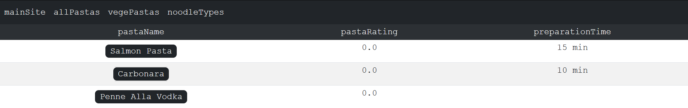
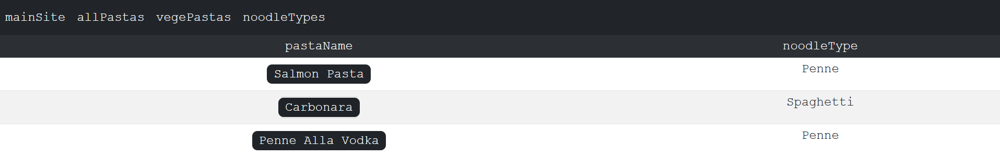

# PastaWebApp
### Pasta API created as final project for Advanced Java on III SEM PJAIT 

## allPastas list with rating and preparation time

## noodleTypes list sorted with types of noodles in specific pasta

